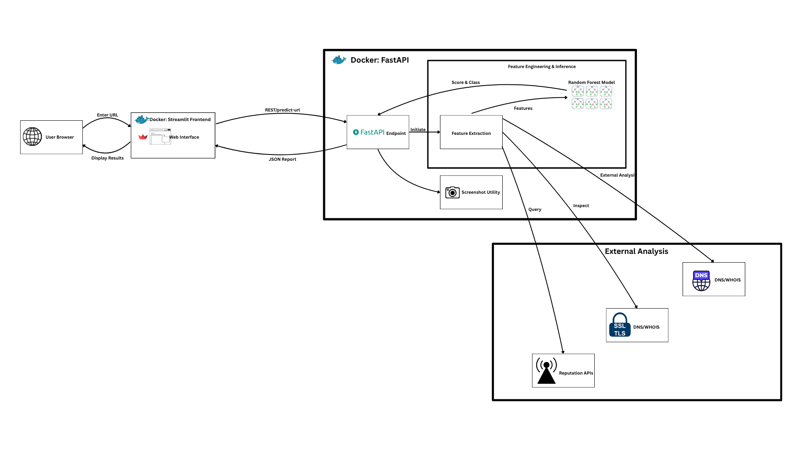

#  Mailharpoon: Phishing Detection & Insights

[](https://www.python.org/)
[](https://fastapi.tiangolo.com/)
[](https://streamlit.io/)
[](https://www.docker.com/)
[](https://scikit-learn.org/)

**MailHarpoon** is a professional-grade, machine learning-powered security tool designed to identify and analyze phishing URLs with high precision. By combining advanced feature extraction with a robust Random Forest classifier, it provides real-time risk assessment and deep network intelligence for any given URL.

---

## 🚀 Key Features

- **🧠 Intelligent Detection**: Uses a Random Forest model trained on the UCI Phishing Dataset to classify URLs based on 30+ distinct technical features.
- **🌐 Network Intelligence**: Performs real-time DNS records, SSL/TLS certificate validation, and WHOIS domain age lookups.
- **📸 Visual Preview**: Safely captures a full-page screenshot of the target site using Playwright to identify visual deception.
- **🛡️ Reputation Checks**: Integrates with reputation APIs to check domains against known blacklists.
- **⚡ High Performance**: Fast inference engine built with FastAPI and an interactive, modern dashboard powered by Streamlit.
- **🐳 Deployment Ready**: Fully containerized with Docker and Docker Compose for seamless deployment in any environment.

---

## System Architecture

<p align="center">
  
</p>

The system follows a modern, containerized microservices architecture:
1.  **Frontend (Streamlit)**: High-level UI for user interaction and report generation.
2.  **Backend (FastAPI)**: Heavy-lifting service for feature extraction, external lookups, and model inference.
3.  **Intelligence Layer**: Asynchronous tasks for screenshot capturing and multi-source data gathering.

---

## 🛠️ Tech Stack

- **Frontend**: Streamlit, Requests, Pandas
- **Backend**: FastAPI, Uvicorn, Pydantic, Playwright
- **Machine Learning**: Scikit-Learn, Joblib, NumPy
- **DevOps**: Docker, Docker Compose, Pathlib (deployment-safe path logic)

---

## 📁 Project Structure

```text
mailharpoon/
├── backend/                # FastAPI Microservice
│   ├── src/                # Source code (API, Logic, Config)
│   ├── models/             # Trained ML models & feature sets
│   └── Dockerfile          # Backend containerization
├── frontend_streamlit/     # Streamlit Web App
│   ├── pages/              # Multi-page application structure
│   ├── images/             # UI assets
│   └── Dockerfile          # Frontend containerization
├── docker-compose.yml      # Multi-container orchestration
├── .env.example            # Deployment environment template
└── requirements.txt        # Full project dependencies
```

---

## Getting Started

### Prerequisites
- Python 3.11+
- Docker & Docker Compose (Recommended)

### Option 1: Running with Docker (Recommended)
The fastest way to get the entire system up and running:

```bash
# Clone the repository
git clone https://github.com/Andrej-Art/Mailharpoon.git
cd Mailharpoon

# Launch the system
docker-compose up --build
```
*The frontend will be available at `http://localhost:8501`, and the backend at `http://localhost:8000`.*

### Option 2: Local Development
```bash
# Install dependencies
pip install -r requirements.txt

# Start Backend
cd backend/src
python main.py

# Start Frontend (in a new terminal)
cd frontend_streamlit
streamlit run app.py
```

---

## API Reference

### Predict URL
`POST /predict-url`

**Request:**
```json
{
  "url": "https://suspicious-site.com/login",
  "model": "rf_full",
  "extended": true
}
```

**Response:**
```json
{
  "prediction": "Malicious",
  "phishing_probability": 0.86,
  "legit_probability": 0.14,
  "model_used": "rf_full"
}
```

---

## Author
**Andrej Artuschenko**
- GitHub: [@Andrej-Art](https://github.com/Andrej-Art)
- Email: andrejart95@gmail.com

