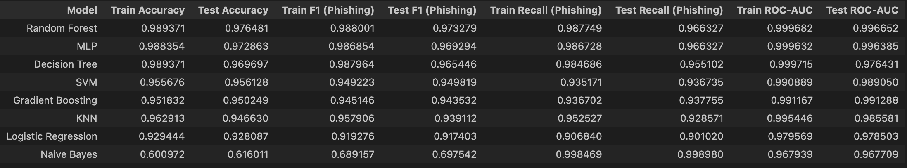
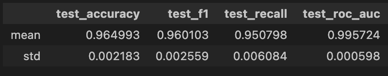

#  Mailharpoon: Phishing Detection & Insights


**Mailharpoon** is a machine learning-based tool designed to analyze URLs and identify potential phishing attempts. The project combines data science techniques with an interactive web interface to provide users with a risk score and detailed insights into suspicious URL characteristics.

## Overview

Phishing attacks often use deceptive URLs to trick users into revealing sensitive information. Mailharpoon leverages the **UCI Phishing Websites Dataset** to train classification models that can distinguish between legitimate and malicious websites based on 30+ features (e.g., URL length, SSL state, domain registration length).

## Key Features

- **Interactive URL Analyzer**: Paste a URL to get an instant risk assessment.
- **Machine Learning Insights**: Explore the principles behind the classification models.
- **Educational Content**: Learn what phishing is and how to protect yourself.
- **Modern UI**: A sleek, dark-mode dashboard built with Streamlit.

## Machine Learning Models

Various machine learning models were trained and evaluated to identify the best performing model for phishing detection. The following models were trained:

- Random Forest
- MLP
- Decision Tree
- SVM
- Gradient Boosting
- KNN 
- Logistic Regression
- Naive Bayes



To assess the stability and generalization capability of the Random Forest classifier, a 5-fold Stratified Cross-Validation was performed on the full dataset. Stratification ensures that the class distribution (phishing vs. legitimate) is preserved across all folds.



The Random Forest model demonstrates:

- High predictive performance across all evaluation metrics.

- Very low standard deviation, indicating strong stability across different data splits.

- Consistent recall for phishing detection, which is critical in a security context.

- Excellent discriminative power, as reflected by the near-perfect ROC-AUC.

The small variance between folds suggests that the Random Forest model generalizes well and is not overly dependent on a specific train-test split. This confirms that the previously observed strong test performance is not due to randomness or data leakage.

## Project Structure

- `backend/`: Data processing and model development.
  - `data/`: Raw and processed datasets.
  - `notebooks/`: Jupyter Notebooks for EDA, Preprocessing, and Modeling.
- `frontend_streamlit/`: The interactive web application.
- `images/`: Brand assets and supplementary visuals.
- `requirements.txt`: Project dependencies.

## Tech Stack

- **Language**: Python
- **Web Framework**: Streamlit
- **Data Science**: Pandas, NumPy, Scikit-learn
- **Visualization**: Matplotlib, Seaborn

## How to Run

1. **Clone the repository**:
   ```bash
   git clone https://github.com/Andrej-Art/Mailharpoon.git
   cd Mailharpoon
   ```

2. **Install dependencies**:
   ```bash
   pip install -r requirements.txt
   ```

3. **Run the Streamlit app**:
   ```bash
   streamlit run frontend_streamlit/app.py
   ```

---
*Developed by Andrej Artuschenko*
